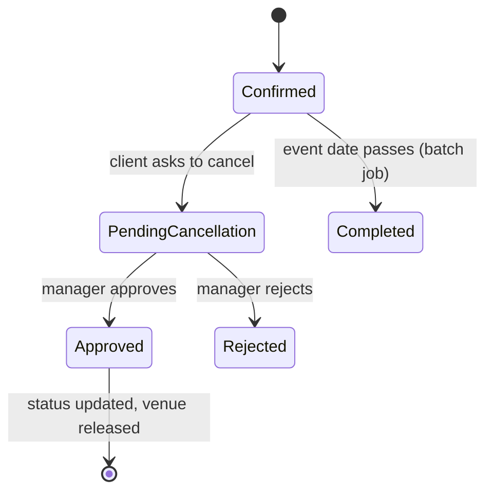
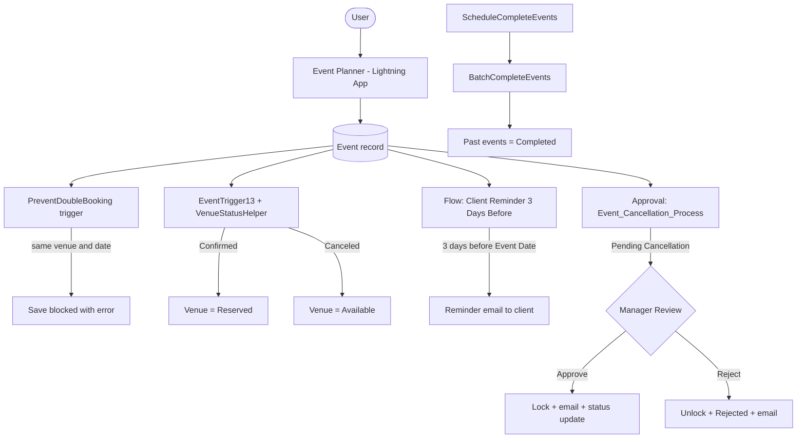

# 🎪 EventForce Management System

## 🎯 Theme

**Smart Event Booking and Management with Salesforce Automation**

EventForce is a Salesforce-based event management system designed to automate venue booking, streamline scheduling, and improve coordination among clients, venues, vendors, and managers. It prevents double booking, sends reminder notifications, and simplifies cancellation approvals using Salesforce Flow, Approval Process, and Apex.

---

## 🎥 Project Resources

- 🎬 **Demo Video:** [Watch Project Demo](https://drive.google.com/file/d/1u-IxBx4bb3obUf0Qpkw30L5yow12I_6V/view?usp=drive_link)
- 📄 **Project Documentation:** [View Project Documentation](https://drive.google.com/file/d/1Zg6DcvIorrtjdEZewLg1rUZk9niHKTPn/view?usp=drive_link)

---

## 👥 Team Details

**Team ID:** SWTID-2026-6752
**Team Size:** 3
**College:** St. Joseph's College of Engineering and Technology, Thanjavur
**College Code:** 8219

| Name | Role | NMID |
|------|------|------|
| Grace Evangelin J | Team Leader | 7f7324588f25ecbb1fe44e81d48f93d8 |
| Beulah J | Team Member | 5771533c80f3c7582af42ba256e51c26 |
| Jayasri K | Team Member | 293a553178634b48f21413135b8192ed |

---

## 💡 Why EventForce?

Picture a small event company. A client calls to book a birthday party. The coordinator writes it in a notebook, a vendor is told on WhatsApp, and two days later another client is promised the *same venue on the same date*. Nobody reminds the client, and a cancellation is just a phone call that no one records.

EventForce replaces that chaos with one connected Salesforce app where **the rules are enforced by the system, not by memory**.

---

## 📖 A Day in the Life

| Step | What happens | Who does the work |
|------|--------------|-------------------|
| 1️⃣ | A coordinator creates an **Event** for a Client at a Venue | Coordinator |
| 2️⃣ | If the venue is already taken on that date, the save is **blocked** | Apex trigger |
| 3️⃣ | The status moves to **Confirmed** and the venue becomes **Reserved** | Apex trigger |
| 4️⃣ | Three days before the event, the client gets a **reminder email** | Record-Triggered Flow |
| 5️⃣ | The client changes plans, so the status is set to **Pending Cancellation** | Coordinator |
| 6️⃣ | The record is **locked** and a manager is asked to approve | Approval Process |
| 7️⃣ | Approved or rejected, the **email goes out** and the record is updated or unlocked | Approval Process |
| 8️⃣ | Old events are closed as **Completed** every night | Scheduled Batch Apex |
| 9️⃣ | The dashboard shows what is coming up | Report and Dashboard |

---

## 🚀 Key Features

### 🔹 Double-Booking Prevention

The trigger `PreventDoubleBooking` looks at the existing events of the same venue. If another event has the same date, the save is stopped with:

> *This Venue is already booked on this date.*

### 🔹 Automatic Venue Status

| Event Status | Venue Availability Status |
|--------------|---------------------------|
| 🟢 `Confirmed` | `Reserved` |
| 🔴 `Canceled` | `Available` |

Handled by `EventTrigger13` and `VenueStatusHelper`, with no manual step.

### 🔹 Event Cancellation Approval

The **Event_Cancellation_Process** starts when **Event Status = Pending Cancellation**.

| Stage | Actions |
|-------|---------|
| Initial submission | Record Lock + Email Alert "Alert - Event Cancellation Request" |
| Final approval | Record Lock + Email Alert "Cancellation Approved" + Field Update "Event Status Update" |
| Final rejection | Record Unlock + Field Update "Event Status To Rejected" + Email Alert "Cancellation Rejected" |
| Recall | Record Unlock |

### 🔹 Client Reminder Flow

The Record-Triggered Flow **Client Reminder 3 Days Before** runs on the Event object:

- **Run Immediately** path
- **Schedule_3_Days_Before** path: waits until 3 days before the event date, then runs `Alert_Client_3Day_Reminder` to email the client

### 🔹 Email Validation

The validation rule **Email_Valid_Address** on Client blocks a wrong email and shows:

> *Please Enter Valid Email Address*

### 🔹 Automatic Event Completion

`BatchCompleteEvents` finds events dated before today that are not `Completed` and sets them to `Completed`. `ScheduleCompleteEvents` runs it with a batch size of 200.

---

## 🔄 Event Status Journey



---

## 🏗️ Architecture



---

## 🗂️ Data Model

| Object | Key Fields |
|--------|-----------|
| **Event** | Event Name, Client (Lookup), Venue (Lookup), Event Date, Event Type, Event Status, Event Budget (Formula, Currency) |
| **Client** | Client Name, Phone, Email, Address, City, Country |
| **Vendor** | Vendor Name, Phone, Email, Service Type (Multi-select), Status |
| **Venue** | Venue Name, Address, Location (URL), Capacity, Availability Status |
| **Feedback** | Feedback (Auto Number), Client (Lookup), Event (Lookup), Rating, Comments |
| **Event Vendor** | Event (Master-Detail), Vendor (Master-Detail), a junction object |

| Relationship | Type | Purpose |
|--------------|------|---------|
| Event → Client | Lookup | Each event belongs to a client |
| Event → Venue | Lookup | Each event is held at a venue |
| Feedback → Event | Lookup | Feedback is given for an event |
| Feedback → Client | Lookup | Feedback comes from a client |
| Event Vendor → Event / Vendor | Master-Detail | Many-to-many link between Event and Vendor |

---

## 💻 Apex Components

| Component | Type | Purpose |
|-----------|------|---------|
| `EventTrigger13` | Trigger (after insert, after update) | Calls `VenueStatusHelper` when an event is saved |
| `VenueStatusHelper` | Apex Class (with sharing) | Sets the venue to Reserved or Available from the event status |
| `PreventDoubleBooking` | Trigger | Blocks two events at the same venue on the same date |
| `BatchCompleteEvents` | Batch Apex | Marks past, non-completed events as Completed |
| `ScheduleCompleteEvents` | Schedulable Apex | Runs the batch job (batch size 200) |

<details>
<summary><b>Peek at the code: VenueStatusHelper</b></summary>

```apex
public with sharing class VenueStatusHelper {
    public static void updateVenueStatus(List<Event__c> events){
        List<Venue__c> venues = new List<Venue__c>();
        for(Event__c ev : events){
            if(ev.Venue__c != null){
                if(ev.Event_Status__c == 'Confirmed'){
                    venues.add(new Venue__c(Id=ev.Venue__c, Availability_Status__c='Reserved'));
                } else if(ev.Event_Status__c == 'Canceled'){
                    venues.add(new Venue__c(Id=ev.Venue__c, Availability_Status__c='Available'));
                }
            }
        }
        if(!venues.isEmpty()) update venues;
    }
}
```

</details>

<details>
<summary><b>Peek at the code: BatchCompleteEvents</b></summary>

```apex
global class BatchCompleteEvents implements Database.Batchable<sObject> {
    global Database.QueryLocator start(Database.BatchableContext bc){
        return Database.getQueryLocator(
            'SELECT Id, Event_Date__c, Event_Status__c FROM Event__c WHERE Event_Date__c < TODAY AND Event_Status__c != \'Completed\''
        );
    }
    global void execute(Database.BatchableContext bc, List<Event__c> scope){
        for(Event__c ev : scope){
            ev.Event_Status__c = 'Completed';
        }
        update scope;
    }
    global void finish(Database.BatchableContext bc){
        System.debug('Past events marked as Completed');
    }
}
```

</details>

---

## 🖥️ UI Customization

- **Custom Tabs:** Clients, Events, Feedbacks, Vendors, Venues
- **Lightning App:** Event Planner (Events, Venues, Clients, Vendors, Feedbacks, Event Vendors, Reports, Dashboards)
- **Report:** New Events with Venue Report, grouped by Event Date
- **Dashboard:** EventForce Operations Dashboard with an *Upcoming Events by Month* donut chart

---

## 🔐 Security and Access

| User | Role | Profile |
|------|------|---------|
| Sizzler Jaligam | Event Admin | Event Admin |
| Nawin Prasath | Event Coordinator | Event Coordinator |
| Lakshmi sri | Vendor Manager | Vendor Manager |

- **Client Profile:** a custom profile on the Salesforce Platform license
- **Permission Set:** *Feedback Manager*, assigned to Nawin Prasath (Event Coordinator)
- **Role hierarchy:** Event Admin sits under the CEO; Client, Event Coordinator and Vendor Manager sit below Event Admin

| Object | Organization-Wide Default |
|--------|---------------------------|
| Event | Private |
| Client, Feedback, Vendor, Venue | Public Read/Write |

---

## 🧪 Test Cases

These are the planned checks for each feature. Results are recorded in the project documentation.

| ID | Feature | Expected Result |
|----|---------|-----------------|
| TC-01 | Email validation | An invalid email is blocked with the error message |
| TC-02 | Double booking | A second event at the same venue and date fails to save |
| TC-03 | Venue reserved | A `Confirmed` event sets the venue to Reserved |
| TC-04 | Venue available | A `Canceled` event sets the venue to Available |
| TC-05 | Cancellation approval | The record locks, the status updates and an email is sent |
| TC-06 | Cancellation rejection | The record unlocks, the status becomes Rejected and an email is sent |
| TC-07 | Client reminder Flow | The reminder is sent 3 days before the event date |
| TC-08 | Batch job | A past event is set to Completed |
| TC-09 | Access control | Each user sees only what the profile, role and OWD allow |

---

## 📅 Agile Plan

6 sprints, **40 story points** in total (about 6.7 points per sprint). All sprints were completed on **02-10-2026**.

| Sprint | User Story | Points | Owner |
|--------|-----------|--------|-------|
| 1 | Create and configure the Developer org | 2 | Grace Evangelin J |
| 2 | Objects, fields and relationships | 5 | Beulah J |
| 2 | Client email validation rule | 2 | Jayasri K |
| 3 | Event cancellation Approval Process | 5 | Grace Evangelin J |
| 3 | 3-day Client Reminder Flow | 3 | Jayasri K |
| 4 | Apex for venue status and double booking | 8 | Grace Evangelin J |
| 4 | Batch and Schedulable Apex | 5 | Beulah J |
| 5 | Tabs, Event Planner app, report, dashboard | 5 | Jayasri K |
| 6 | Profiles, roles, users, permission set, sharing | 5 | Beulah J |

---

## ⚠️ Known Limitations

- The double-booking check compares only the event date, not start and end times
- It also counts `Canceled` events, so a cancelled booking still blocks that venue and date
- Venue status follows the last saved event, so cancelling one event can show a venue as Available even if it has another confirmed event on a different date
- The batch job completes **every** past event that is not `Completed`, including cancelled ones
- The approval has a single step with one approver
- No sharing rules or client portal yet
- No Apex test classes yet (needed for a production deployment)
- Reminder emails need a verified email sending domain

---

## 🔮 Future Enhancements

- ⏰ Time-slot and overlapping-date checks for bookings
- 🚫 Ignore `Canceled` events in the double-booking check and in the batch job
- ✅ Multi-step approvals with escalation
- 🌐 Sharing rules and a client portal
- 🧪 Apex test classes with production-level code coverage
- 📱 SMS or WhatsApp reminders
- 📊 Reports and dashboards for vendor performance, feedback ratings and budgets

---

## 📁 Repository Structure

```
EventForce-Management-System/
├── README.md
├── docs/
│   ├── EventForce_Project_Documentation_SWTID-2026-6752.pdf
│   └── screenshots/
└── apex/
    ├── classes/
    │   ├── VenueStatusHelper.cls
    │   ├── BatchCompleteEvents.cls
    │   └── ScheduleCompleteEvents.cls
    └── triggers/
        ├── EventTrigger13.trigger
        └── PreventDoubleBooking.trigger
```

The objects, Flow, Approval Process and security settings were configured directly in the Salesforce org. They are documented, with screenshots, in the PDF above.

---

## 🛠️ Setup

1. Create a Salesforce Developer Edition org
2. Create the six custom objects, fields and relationships
3. Add the `Email_Valid_Address` validation rule on Client
4. Build the `Event_Cancellation_Process` approval process
5. Build and activate the `Client Reminder 3 Days Before` Flow
6. Add the Apex classes and triggers from the `apex/` folder (API version 67)
7. Schedule the batch job from Developer Console:
   ```apex
   System.schedule('Complete Past Events', '0 0 1 * * ?', new ScheduleCompleteEvents());
   ```
8. Create the tabs, Event Planner app, report and dashboard
9. Set up profiles, roles, users, the permission set and sharing settings

---

## 🏫 Institution

**St. Joseph's College of Engineering and Technology, Thanjavur**

College Code: 8219
